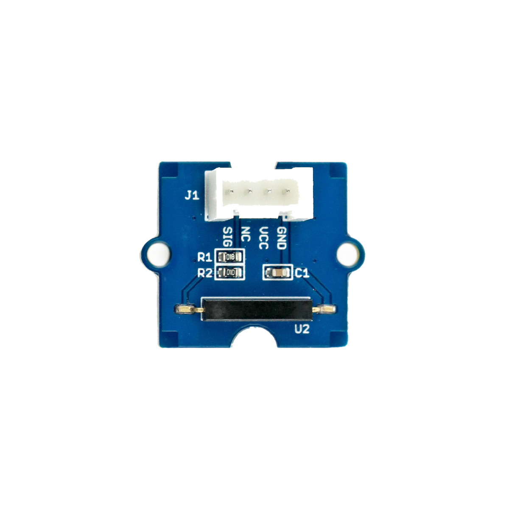

# Kippschalter

## Beschreibung
Der Kippschalter funktioniert wie ein normaler Schalter. Er kann als Eingabe für einen Mikrocontroller verwendet werden. Der Sensor besteht aus mehreren Metallkugeln, die nur dann einen elektrischen Kontakt herstellen, wenn der Sensor hochkant steht. Der Sensor gibt ein digitales Signal aus, sobald er eine gewisse Neigung erreicht. Er kann direkt oder mithilfe des Grove Shields an einen Arduino oder Raspberry Pi angeschlossen werden. Der Schalter benötigt nur einen digitalen Pin.

Der Kippschalter kann eingesetzt werden, um einen Grenzwinkel für eine beliebige Neigung zu ermitteln und davor zu warnen.

Alle weiteren Hintergrundinformationen sowie ein Beispielaufbau und alle notwendigen Programmbibliotheken sind auf dem offiziellen Wiki (bisher nur in englischer Sprache) von Seeed Studio zusammengefasst. Zusätzlich findet man über alle gängigen Suchmaschinen durch die Eingabe der genauen Komponentenbezeichnung entsprechende Projektbeispiele und Tutorials.

<!-- infolist -->

<!-- infolists -->
## Wichtige Links für die ersten Schritte:

- [Seeed Studio Wiki](http://wiki.seeedstudio.com/Grove-Tilt_Switch/) [- Kippschalter](http://wiki.seeedstudio.com/Grove-Tilt_Switch/)
- [Adafruit - Kippschalter](https://learn.adafruit.com/tilt-sensor/using-a-tilt-sensor)

## Projektbeispiele:

- [Adafruit - Wecker mit Neigungssensor](https://learn.adafruit.com/tilt-sensor/example-projects)

## Weiterführende Hintergrundinformationen:

- [Schalter](https://de.wikipedia.org/wiki/Schalter_\(Elektrotechnik\)) [(Elektrotechnik)](https://de.wikipedia.org/wiki/Schalter_\(Elektrotechnik\)) [- Wikipedia Artikel](https://de.wikipedia.org/wiki/Schalter_\(Elektrotechnik\))
- [GPIO - Wikipedia Artikel](https://de.wikipedia.org/wiki/Allzweckeingabe/-ausgabe)
- [GitHub-Repository: Kippschalter](https://github.com/MakeYourSchool/24-Kippschalter)

